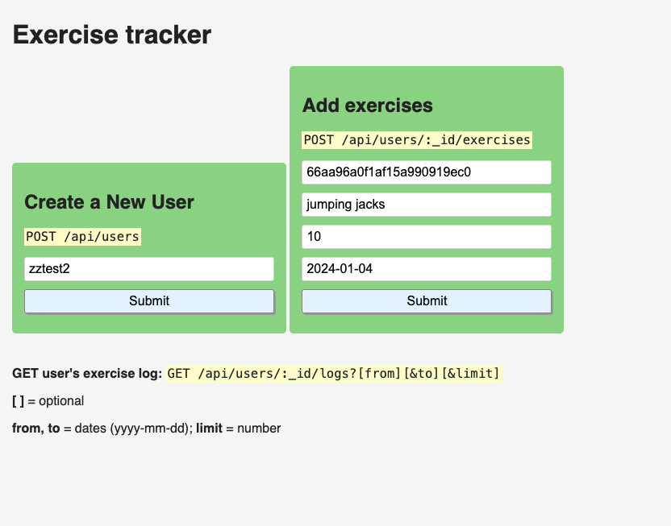

# Exercise Tracker API



## Description
This project is an Exercise Tracker API that allows users to create accounts, log exercises, and retrieve their exercise history. It's built using Node.js and Express.js, with MongoDB as the database.

## Table of Contents
- [Exercise Tracker API](#exercise-tracker-api)
  - [Description](#description)
  - [Table of Contents](#table-of-contents)
  - [Features](#features)
  - [Installation](#installation)
  - [API Endpoints](#api-endpoints)
  - [Usage](#usage)
    - [Creating a new user](#creating-a-new-user)
    - [Adding an exercise](#adding-an-exercise)
    - [Getting user logs](#getting-user-logs)
  - [Scripts](#scripts)
  - [Contributing](#contributing)
  - [License](#license)


## Features
- User registration
- Adding exercises for users
- Retrieving exercise logs with various query parameters
- RESTful API design

## Installation

1. Clone the repository:
   ```sh
   git clone git@github.com:oshkoshbagoshh/fcc-exercise-tracker2.git
   ```

2. Navigate to the project directory:
   ```sh
   cd fcc exercise-tracker2
   ```
3. Install dependencies
   ```sh
   npm install
   ```
4. Set up your environment variables in an `.env` file
   ```env
   PORT=3000
   MONGODB_URI=your_mongodb_connnection_string
   ```
5. Start the server
   ```sh
   npm start
   ```

## API Endpoints

- `POST /api/users` - Create a new user
- `POST /api/users/:_id/exercises` - Add an exercise for a user
- `GET /api/users/:_id/logs` - Get exercise logs for a user

## Usage

### Creating a new user

```json
POST /api/users
Content-Type: application/json

{
"username": "johndoe"
}
```


### Adding an exercise
```json
POST /api/users/:_id/exercises
Content-Type: application/json

{
    {
        "description": "Running",
        "duration": 30,
        "date": "2023-07-01"
}
}
```

### Getting user logs
```sh
GET /api/users/:_id/logs?from=2023-07-01&to=2023-07-31&limit=5
```

## Scripts
- `npm start` - Start the server
- `npm run dev` - Start the server with nodemon for development
- `npm test` - Run tests

## Contributing
Pull requests are welcome. For major changes, please open an issue first to discuss what you would like to change.
- AJ Javadi 
- Free Code Camp

## License
[MIT](https://choosealicense.com/licenses/mit/)
